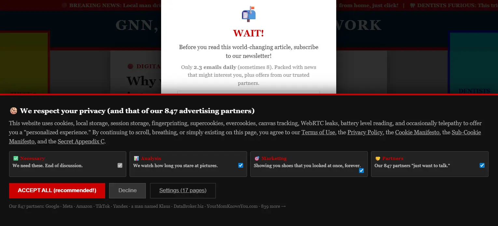

# Digital Nightmare

A web-based satirical experiment that pushes digital madness to its absolute limit. This project is a commentary on the modern web's obsession with clicks over readability: loud, annoying, and deliberately designed to get worse with every interaction.

[Live Demo](https://nicohartmann.dev/digital_nightmare_en.html)



## What is Digital Nightmare?

Digital Nightmare is a satirical webpage that distills everything exhausting about the modern internet into a single, concentrated experience, without even pretending to inform you. It is a direct response to a digital landscape where engagement metrics have overtaken reading comfort.

The louder it gets, the more you click. That's the point.

> As soon as you leave this digital purgatory, normality awaits you on the rest of the site.

## Features

- **Sensory Overload:** A carefully crafted assault on the senses, because the modern web never holds back, and neither does this.
- **Escalating Chaos:** Every click makes things worse. Deliberately.
- **Satirical Design:** Every UI decision is intentional. A mirror held up to the dark patterns and attention-grabbing tricks of today's internet.
- **No Pretense:** Unlike the sites it parodies, Digital Nightmare is honest about what it is.

## The Message

This project exists as a contrast. After surviving Digital Nightmare, the calm and clarity of the rest of the portfolio should feel like a breath of fresh air. The discomfort is the point. Hopefully, it makes you appreciate thoughtful, user-centered design all the more.

## Tech Stack

- **HTML5:** For the page structure and layout.
- **CSS3:** For the deliberately overwhelming styling and animations.
- **JavaScript:** For the escalating interaction logic and state management.

## Getting Started

To run this project locally, follow these steps:

1. **Clone the Repository**

```bash
git clone https://github.com/kt-NicoHartmann/DigitalNightmare.git
```

2. **Open the Project**

Navigate into the project directory and open the HTML file in your preferred web browser.

```bash
cd DigitalNightmare/digital_nightmare_en/
# On macOS/Linux:
open digital_nightmare_en.html
# On Windows:
start digital_nightmare_en.html
```

Alternatively, use an extension like Live Server in VS Code to host it locally.

> **Warning:** Side effects may include mild irritation, existential dread, and a newfound appreciation for clean web design.
